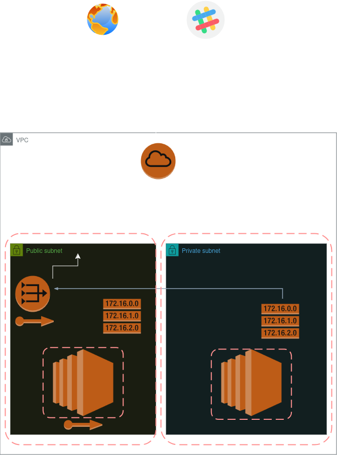

# 🛡️ DevSecOps Terraform Infrastructure

This project provisions a secure AWS environment using Terraform, with built-in security scanning and CI/CD enforcement via GitHub Actions. It demonstrates real-world DevSecOps practices including infrastructure as code, automated vulnerability detection, and alerting.

---

## 🚀 Overview

This setup includes:

- A custom VPC with public and private subnets
- A NAT Gateway for private subnet internet access
- Two EC2 instances:
  - **Public EC2** with a public IP/DNS for SSH and web access
  - **Private EC2** with no public exposure, routed through NAT
- Security groups with:
  - SSH restricted to your LAN (e.g., `192.168.1.0/24`)
  - HTTP/HTTPS open to the internet
  - All outbound traffic allowed
- Terraform state managed in **HashiCorp Terraform Cloud (HCP)**
- CI/CD pipeline scans code on push and fails on critical issues
- Slack alerting included for job status notifications
- **Infrastructure diagram** created using draw.io

---

## 🧱 Infrastructure Components

| Component        | Description                                   |
|------------------|-----------------------------------------------|
| VPC              | Custom CIDR block with internet access        |
| Subnets          | Public + private across different AZs         |
| NAT Gateway      | Enables private subnet to access the internet |
| EC2 Instances    | One public, one private, properly tagged      |
| Route Tables     | IGW for public, NAT for private subnet        |
| Security Groups  | Split ingress/egress rules for control        |
| Outputs          | DNS, public IP, and SSH command               |

---

## 🔐 DevSecOps Pipeline

This project includes a GitHub Actions workflow that:

- Runs `tfsec` on every push to `main`/`master`
- Fails the pipeline if any **HIGH** or **CRITICAL** vulnerabilities are detected
- Uploads the scan results as an artifact (`iac-scan.json`)
- Sends a Slack notification with the job result and commit link

Slack messages include:
- ✅ Job status (`success`, `failure`, etc.)
- 📎 Link to commit
- 🧑 Triggering GitHub user

---

## 🛠️ Usage

### 1. Clone the Repository

```bash
git clone https://github.com/Nicholas-devsec/Terraform_Pipeline.git
cd Terraform_Pipeline
```

### 2. Initialize and apply the Terraform configuration

```bash
terraform init
terraform plan
terraform apply
```

### 3. SSH into the public EC2 instance

```bash
ssh -i public-instance.pem ubuntu@<public_dns>
```


## 🧪 Terraform Outputs

After applying the configuration, Terraform prints:

- `public_instance_dns` – DNS name of the public EC2 instance
- `public_instance_ip` – Its public IP address
- `ssh_command` – Ready-to-use SSH string

---

## ☁️ Remote Backend

This project uses a **Terraform Cloud backend** (`hcp`) for remote state management, versioning, and team access.

---

## 🗺️ Architecture Diagram

The following diagram was created using [draw.io](https://draw.io) to visualize the infrastructure setup:



---

## 🔚 Final Thoughts

This project demonstrates foundational DevSecOps principles:

- Infrastructure-as-Code (Terraform)
- Secure cloud architecture (AWS best practices)
- CI/CD automation with built-in security gating
- Slack-integrated alerts for visibility

---

> 🔧 Built by Nicholas Yovanovich — aspiring DevSecAI engineer with a passion for secure, scalable cloud infrastructure.
